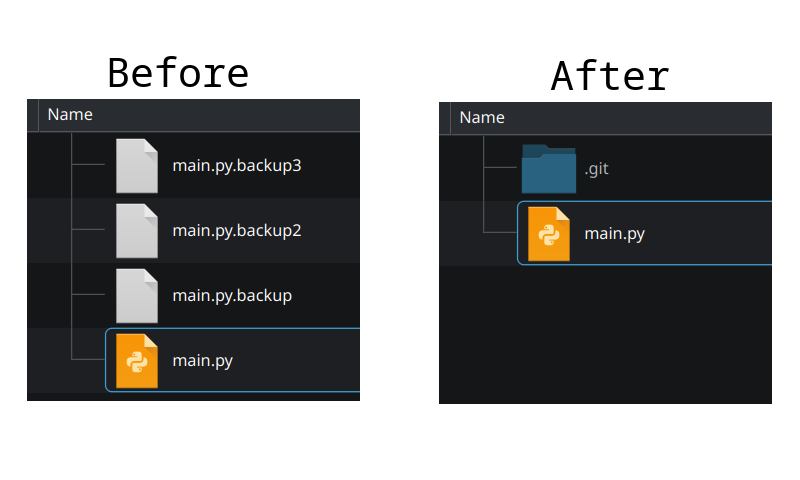

# Introduction

## What is Git?
**Git** is a **version control system** that helps you track changes to your code over time. It allows you to save snapshots of your work so you can return to an earlier version if needed. It also makes collaboration easier by organising and combining changes from different people.

Picture yourself coding and making changes throughout the day. To avoid losing earlier work, you start creating backup copies of your files. Soon, these copies pile up and it becomes hard to keep track of them.

Instead, you can use Git to save snapshots of your code as you work. This way, you only need to manage one set of files, and Git keeps track of all the different versions for you automatically.

## Installing Git
...