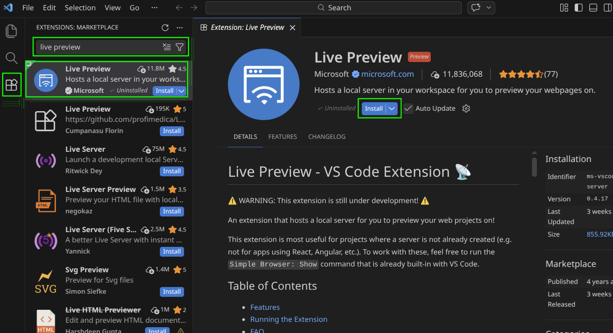

# Live Preview
**Live Preview** is a **VSCode extension** that lets you see changes to your static website in real time.

## Installing
1. Open VSCode
2. Open the Extensions tab (Ctrl + Shift + X)
3. Search for `Live Preview`
4. Verify the extension is owned by `Microsoft`
5. Click the `Install` button

## Usage
TODO..